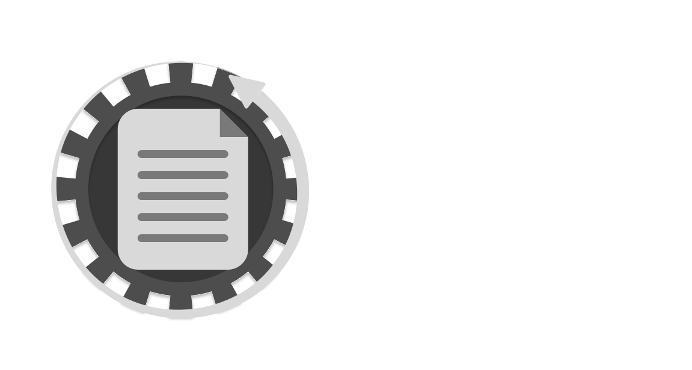

<p align="center"></p>

Keep your documentation in sync with your code. AutoDoc diffs your staged changes, asks an AI what docs need updating, shows you exactly what will change, and writes the file only after you approve.

---

## Install

```bash
npm install -g autodoc-cli
```

Requires Node 18+.

---

## Quick start

```bash
# 1. Set up autodoc in your project
cd your-project
autodoc init

# 2. Make code changes, stage them
git add .

# 3. Update the docs
autodoc build

# 4. Commit everything
git add docs/doc.md && git commit -m "..."
```

---

## How it works

`autodoc build` runs before you commit:

1. Reads your staged diff (`git diff --staged`)
2. Sends the diff + your current doc file to the AI
3. Prints a summary of what needs to change and why
4. Asks for confirmation
5. Writes the updated doc file

Nothing is written without your approval.

---

## Commands

### `autodoc init`

Interactive setup. Creates a `.autodocrc` in the current directory.

### `autodoc build`

Analyze changes and update documentation.

| Flag | Description |
|---|---|
| `-y, --yes` | Skip the confirmation prompt |
| `--diff <type>` | `staged` (default), `last-commit`, or `working` |
| `--doc <path>` | Override the doc file from config |

---

## Configuration

`autodoc init` creates a `.autodocrc` file:

```json
{
  "provider": "gemini",
  "model": "gemini-2.0-flash",
  "apiKey": "your-key",
  "docFile": "./docs/doc.md"
}
```

**Keeping your key out of the config**  set an environment variable instead and leave `apiKey` out of `.autodocrc`:

| Provider | Environment variable |
|---|---|
| Gemini | `GEMINI_API_KEY` |
| Groq | `GROQ_API_KEY` |
| OpenAI | `OPENAI_API_KEY` |
| Anthropic | `ANTHROPIC_API_KEY` |

Or use `AUTODOC_API_KEY` for any provider.

Add `.autodocrc` to your `.gitignore` if the key is stored in it.

---

## Providers

| Provider | Free tier | Default model |
|---|---|---|
| **Gemini** | Yes [aistudio.google.com](https://aistudio.google.com) | `gemini-2.0-flash` |
| **Groq** | Yes [console.groq.com](https://console.groq.com) | `llama-3.1-8b-instant` |
| **OpenAI** | No | `gpt-4o-mini` |
| **Anthropic** | No | `claude-haiku-4-5-20251001` |

Override the model in `.autodocrc` or during `autodoc init`.

---

## Adding to an existing project

```bash
npm install --save-dev autodoc-cli
autodoc init
echo ".autodocrc" >> .gitignore
```

The `.autodocrc` walks up parent directories, so a monorepo can share one config at the root.
